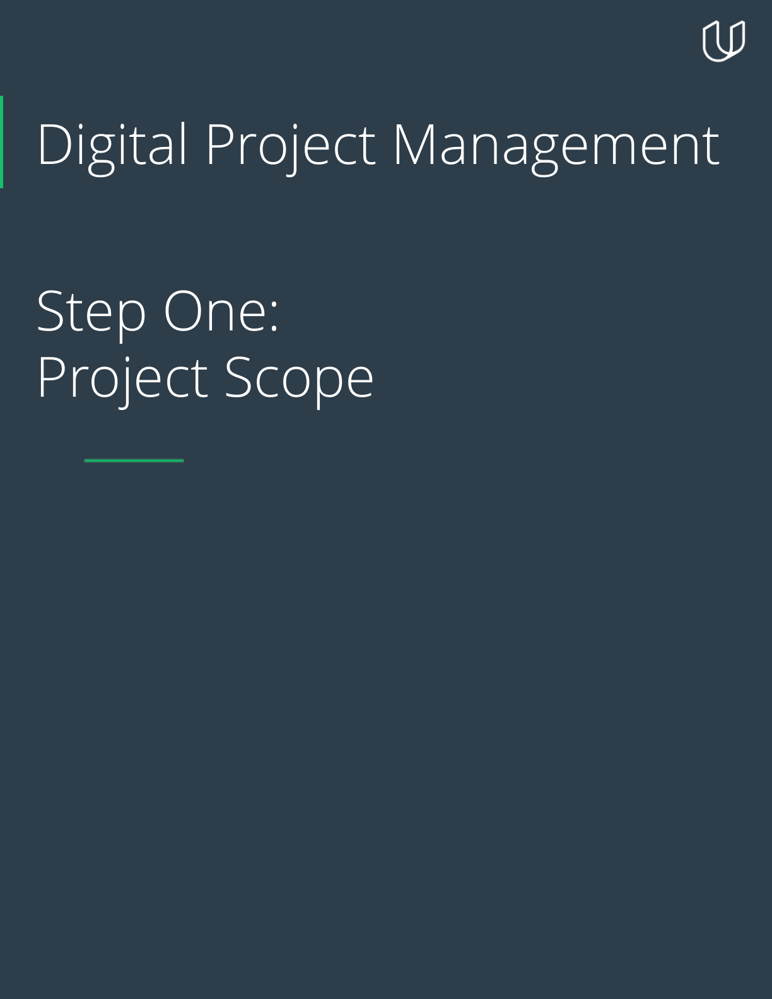
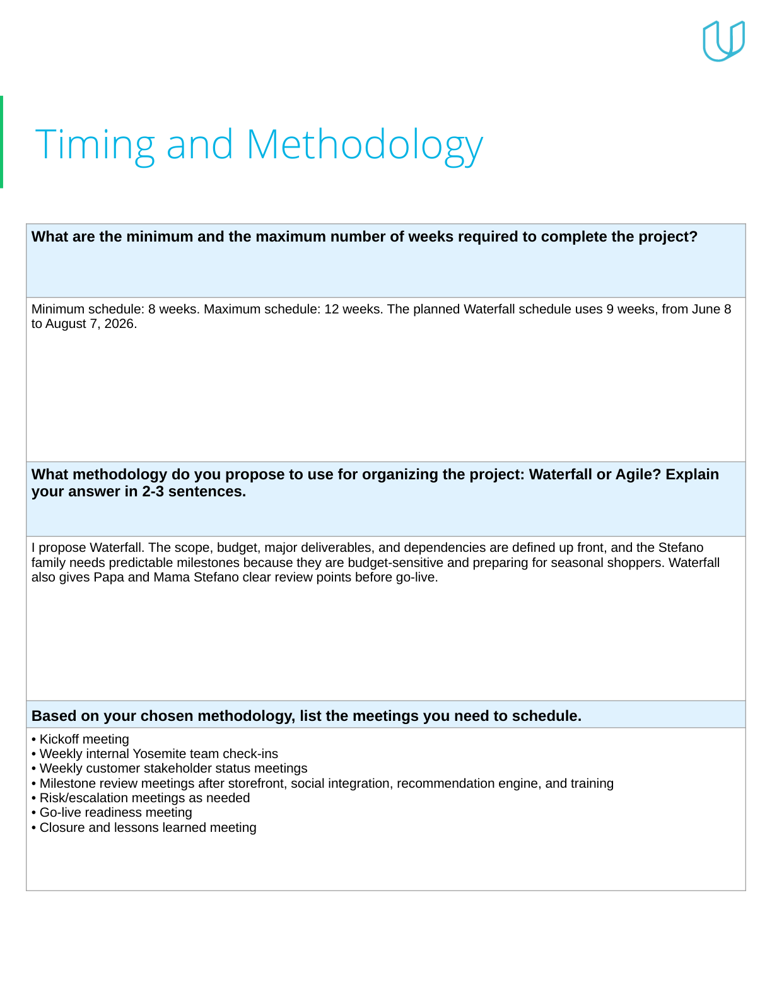
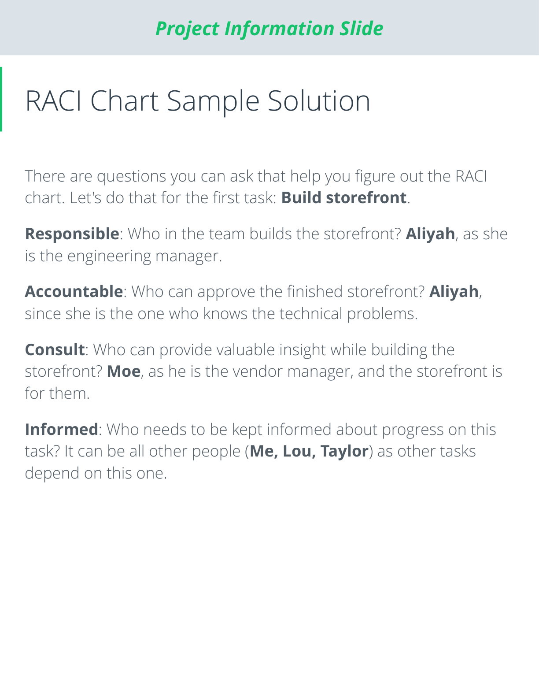
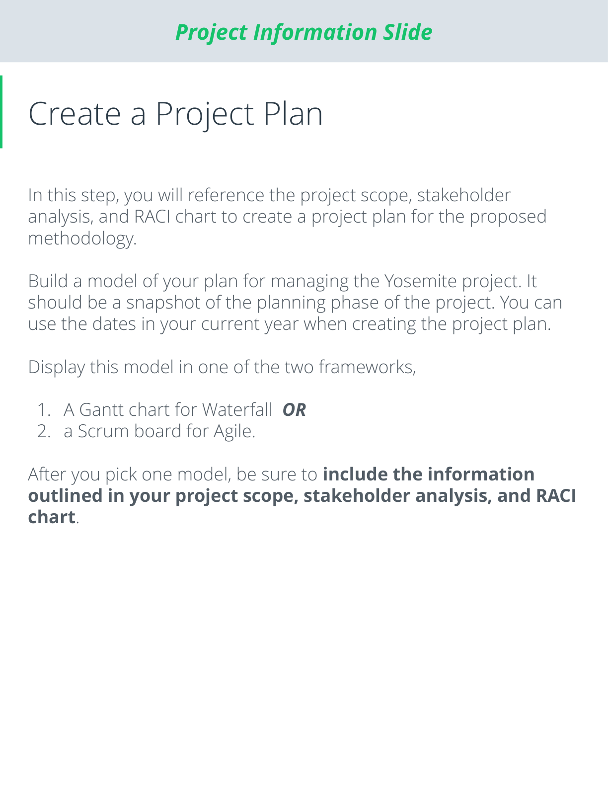

# Yosemite – The Stefano Shop Digital Transformation

## Overview

This project demonstrates the planning and management of a digital transformation initiative for The Stefano Shop, a family-owned retail business migrating to the Yosemite eCommerce platform.

The project includes:

- Project Scope
- Stakeholder Analysis
- Power-Influence Grid
- RACI Matrix
- Waterfall Gantt Chart
- Risk Management Plan
- Knowledge Documentation

---

## Project Information

| Item | Details |
|--------|---------|
| Client | The Stefano Shop |
| Organization | Yosemite eCommerce |
| Methodology | Waterfall |
| Budget | $15,000 |
| Duration | 12 Weeks |
| Project Manager | Hashim Naveed |

---

## Project Screenshots

### Project Cover

### Stakeholder Analysis

### RACI Matrix

### Project Plan

### Risk Management

---

## Project Files

- [Project Report PDF](docs/yosemite_stefano_project_submission.pdf)
- [Project Presentation PPTX](docs/yosemite_stefano_project_submission.pptx)
- [Gantt Chart XLSX](docs/yosemite_stefano_gantt_chart.xlsx)

---

## Skills Demonstrated

- Project Planning
- Stakeholder Management
- Cost-Benefit Analysis
- RACI Matrix Development
- Risk Management
- Waterfall Project Delivery
- Schedule Management
- Documentation Management

---

## Author

Hashim Naveed

GitHub: https://github.com/hashimndl